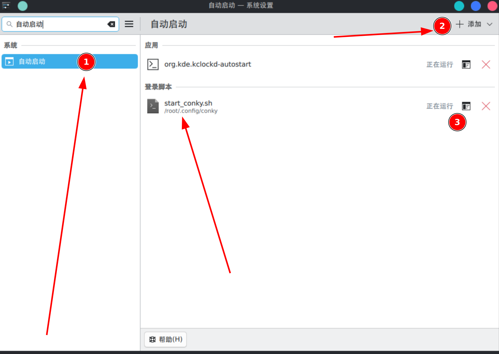

# 定制自己的 Conky 系统监控主题

本项目是一个由 GY 定制开发的 Conky 系统监控主题，旨在为 Linux 系统提供美观且实用的桌面性能监控。

## 项目目录结构详细说明

```text
conky/
├── Conky系统监控主题演示.mp4       # 主题效果演示视频
├── conky-fedora-tree.zip           # GRUB网站下载的最初版，若不喜欢本博主的定制请使用这个
├── manjaro_conkyrc.txt             # 针对 Manjaro系统优化的通用监控配置（根目录下副本）
├── nvidia_conkyrc                  # 含NVIDIA 显卡监控配置文件
├── start_conky.sh                  # 开机自启动脚本
├── README.assets/                  # 说明文档图片资源
└── README.md                       # 项目使用说明文档（当前文件）
```

## conky主题监控信息介绍


该主题 `manjaro_conkyrc` 提供了全方位的系统状态监控，界面布局为右上角树状图结构，从上到下依次包含以下核心模块：

### 1. 基础信息

*   **顶部时钟**：显示当前大号字体的时间及完整日期（年/月/日 星期）。
*   **系统状态**：显示系统运行时间（Uptime）、操作系统版本（Manjaro Linux）及内核版本。

### 2. 处理器 (CPU)
*   显示 CPU 型号。
*   实时监控 CPU 使用率（%）。
*   实时监控 CPU 温度（支持高温警报变色：>70°C）。

### 3. 显卡 (GPU)
*   **核显**：显示 Intel Arc Graphics。
*   **独显**：智能监控 NVIDIA RTX 5060。
    *   当独显工作时：显示 GPU 负载（%）及核心温度。
    *   当独显待机时：自动显示“已休眠”状态，节省资源。

### 4. 内存 (Memory)
*   显示内存已用量 / 总量。
*   显示内存占用百分比。

### 5. 存储 (Disk)
*   **多硬盘监控**：分别监控两块 NVMe 硬盘（nvme0n1 和 nvme1n1）。
    *   显示硬盘型号。
    *   实时显示读/写速度。
    *   实时监控硬盘温度（支持三级温控变色：>40°C 黄色, >50°C 橙色）。
*   **分区监控**：显示根分区（/）的磁盘占用情况。

### 6. 网络 (Network)
*   **主机信息**：显示主机名及公网 IP 地址。
*   **智能总速率**：自动识别默认网关，显示系统总下载/上传速率。
*   **Wi-Fi 7 (BE201)**：显示连接状态、IP 地址及实时上下行网速。
*   **以太网 (Ethernet)**：显示连接状态、IP 地址及实时上下行网速。

> 注：
>
> 每个人的电脑配置，信息都不相同，具体定制自己的监控信息只需要将manjaro_conkyrc.txt （根目录下副本）复制给ai,让ai帮你调整或者自己手动调整，调整完后再复制到nvidia_conkyrc文件。本主题是作者自己调试了很久才调出来比较好的显示效果

## 部署 Conky 主题

按照以下步骤将配置文件部署到系统目录并设置开机自启动。

### 1. 准备配置目录

创建存放配置文件的目录（以 `/root/.config/conky/` 为例，普通用户请使用 `~/.config/conky/`）：

```bash
mkdir -p /root/.config/conky/
```

### 2. 复制配置文件

将项目中的配置文件复制到刚才创建的目录中：

```bash
# 复制显卡监控配置
cp nvidia_conkyrc /root/.config/conky/nvidia_conkyrc
```

### 3. 设置开机自启动脚本

为了让 Conky 在开机时自动运行并加载所有配置，我们需要创建一个启动脚本。

1. **创建脚本文件** `start_conky.sh`：

2. 使用nano编辑器创建脚本
   ```
   nano /root/.config/conky/start_conky.sh
   ```

3. 复制下面这段脚本

   ```bash
   #开机5s后启动conky主题脚本
   sleep 5
   conky -c "$HOME/.config/conky/manjaro_conkyrc" &
   ```

4. **赋予执行权限**：

   ```bash
   chmod +x /root/.config/conky/start_conky.sh
   ```

5. **添加到开机启动项**：
   
   * **方法 A (通过图形界面)**: 在你的桌面环境（如 GNOME, KDE, XFCE）中找到“开机启动程序”或“Startup Applications”设置，添加一个新的启动项，命令指向 `/root/.config/conky/start_conky.sh`。
   
     
   
   * **方法 B (通过 .desktop 文件)**: 在 `~/.config/autostart/` 下创建一个 `.desktop` 文件指向该脚本。

## 快速使用

在正式部署前，你也可以直接运行以下命令进行测试：

```bash
conky -c ./conky/nvidia_conkyrc
```

## 界面优化建议

- 建议安装 `Noto Sans CJK SC` 字体以获得最佳显示效果。
- 配置文件中的 `own_window_transparent` 已开启，若在某些桌面环境下显示黑框，请检查合成器（Compositor）是否正常运行。
